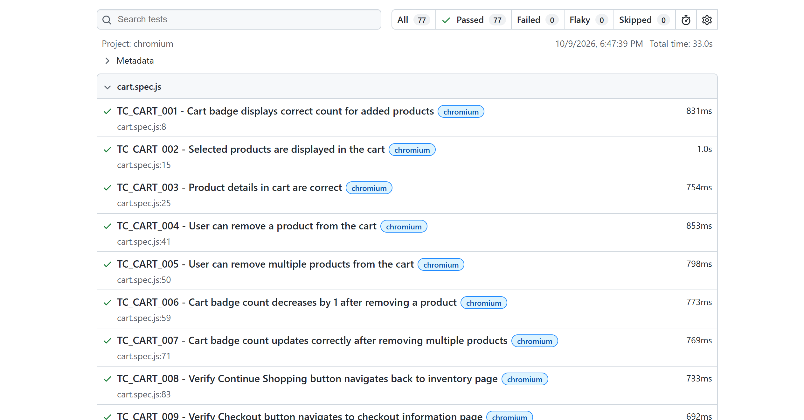
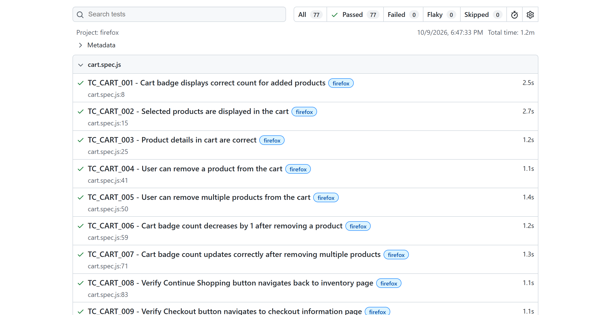
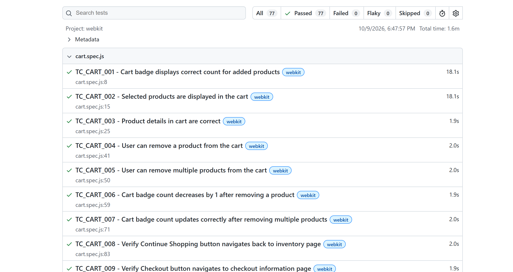

# SauceDemo Playwright POM Framework


End-to-end UI test automation framework for [SauceDemo](https://www.saucedemo.com), built with Playwright and JavaScript using the Page Object Model (POM) pattern. 77 automated tests run on Chromium, Firefox and WebKit, and every push is verified through GitHub Actions.

## Highlights

- 77 test cases across 9 modules, each traceable to a documented test case ID
- Page Object Model with one class per page and custom Playwright fixtures
- Cross-browser execution: Chromium, Firefox and WebKit
- CI/CD on GitHub Actions, with one parallel job per browser
- HTML reports with screenshots, video and traces captured on failure
- Test data kept separate from test logic
- Stability work verified with repeated runs (`--repeat-each=3`) on all browsers

## Tech Stack

| Area            | Tools                               |
|-----------------|------------------------------------ |
| Automation      | Playwright, JavaScript (Node.js 20) |
| Pattern         | Page Object Model, custom fixtures  |
| CI/CD           | GitHub Actions                      |
| Reporting       | Playwright HTML report              |
| Documentation   | Excel test case workbook            |
| Version control | Git, GitHub                         |

## Modules Covered

Login, Product Listing, Product Details, Cart, Side Menu, Checkout (Information, Overview, Completion), Session Management, Navigation Integrity.

Every test name starts with its test case ID (for example `TC_CART_003`). The full test case documentation is in [`test-cases/SauceDemo_TestCases.xlsx`](test-cases/SauceDemo_TestCases.xlsx).

```
## Project Structure

├── .github/workflows/   CI pipeline (GitHub Actions)
├── fixtures/            Custom Playwright fixtures
├── pages/               Page Object classes
├── test-cases/          Test case documentation (Excel)
├── test-data/           Test data
├── tests/               Spec files
├── utils/               Shared helpers (login, etc.)
├── docs/images/         Report screenshots
└── playwright.config.js
```

## Getting Started
```bash
git clone https://github.com/vharshitha2705-dotcom/saucedemo-playwright-pom.git
cd saucedemo-playwright-pom
npm ci
npx playwright install
```

## Running Tests
```bash
npm test                  # all three browsers
npm run test:chromium     # one browser
npm run test:firefox
npm run test:webkit
npm run test:headed       # watch the browser run
npm run test:ui           # Playwright UI mode
npm run report            # open the last HTML report
```

## CI/CD

The workflow in `.github/workflows/playwright.yml` runs on every push and pull request to `main`, and can also be started manually.

- A separate job runs for each browser, so one browser's failure never hides the others
- Failed tests are retried twice in CI to separate real failures from one-off slowness
- The HTML report is uploaded as an artifact on every run, and screenshots, videos and traces are uploaded when something fails

## Test Reports

Latest CI run: 77/77 passing on each browser, 0 flaky.

Chromium



Firefox



WebKit



## Design Decisions

- Fixtures over manual setup: page objects are injected into tests, so specs stay short and readable.
- Auto-waiting assertions: `expect(locator)` assertions retry until they pass, which avoids fixed sleeps.
- Navigation waits in page methods: actions that change the page wait for their destination, so tests never read a half-loaded page.
- Specific locators: locators are scoped to the page they belong to, so they cannot match elements from a different page.
- Test data outside specs: changing data does not mean editing test logic.

## Stability Lessons

Making the suite reliable across three browsers taught me more than writing the tests did:

- Tests that passed in Playwright's UI mode failed headless and in parallel. The cause was one-time reads right after a page change, such as `locator.count()` straight after a click. I replaced them with retrying assertions and added destination waits to navigation methods.
- A strict-mode violation showed a locator matching six buttons on the wrong page. Scoping it to the product details container fixed it.
- WebKit stalled on my Windows machine but ran cleanly on GitHub's Linux runners, which taught me to check failures against the CI environment before changing test code.
- Every fix was verified with repeated runs on all three browsers, not a single green run.

## AI-Assisted Development

I used AI (Claude by Anthropic) as a pair-programming and learning aid while building this project:

- Planning: breaking the work into a day-by-day plan covering config, CI, documentation and release
- Debugging: reading Playwright error logs and traces to find the cause of flaky tests
- CI/CD: drafting the GitHub Actions workflow and the per-browser job setup
- Documentation: structuring this README

I ran and verified every change myself on all three browsers, reviewed the CI results and reports, and committed the work. AI sped up the feedback loop, and I was responsible for checking that each suggestion actually worked.

## Author

Harshitha Veeravalli, QA Engineer
Manual testing, API testing, SQL/database testing, and Playwright automation.